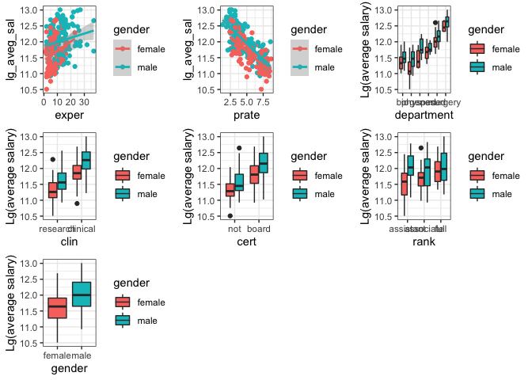
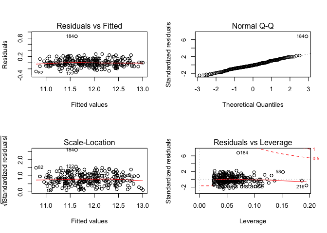
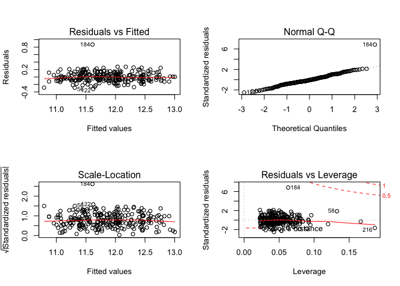
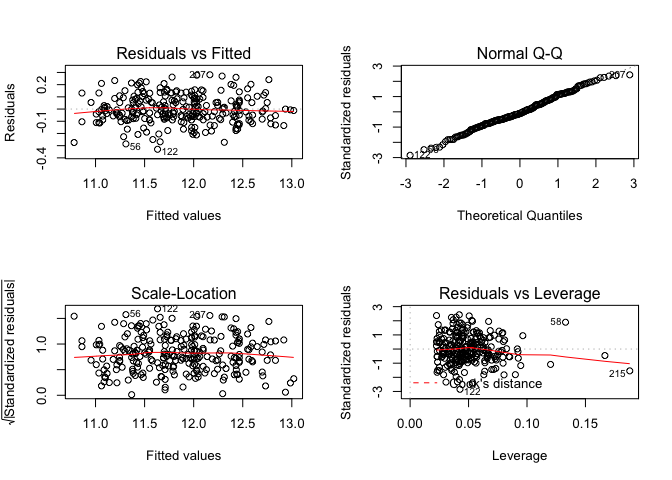

model
================
YI LIU
12/3/2019

``` r
lawsuit = 
  read_csv("./Lawsuit.csv") %>% 
  janitor::clean_names()
```

# take the average of 2 years salary

``` r
lawsuit = 
  lawsuit %>% 
  mutate(
    aveg_sal = (sal94 + sal95)/2,
    lg_aveg_sal = log(aveg_sal)
    )
```

# clean the data and do log transformation

``` r
lawsuit_clean =
  lawsuit %>% 
  mutate(
    dept = as.factor(dept),
    gender = as.factor(gender),
    clin = as.factor(clin),
    cert = as.factor(cert),
    rank = as.factor(rank),
    dept = recode(dept, 
                  "1"= "bio",
                  "2" = "phys",
                  "3" = "gene",
                  "4" = "ped",
                  "5" = "med", 
                  "6" = "surgery"),
    gender = recode(gender, 
                    "0" = "female",
                    "1" = "male"),
    clin = recode(clin, 
                  "1" = "clinical",
                  "0" = "research"),
    cert = recode(cert, 
                  "0" = "not",
                  "1" = "board"),
    rank = recode(rank, 
                  "1" = "assistant",
                  "2" = "associate",
                  "3" = "full")
  ) 
```

# find confounder

``` r
fit_gender = lm(lg_aveg_sal ~ gender, data = lawsuit_clean)
summary(fit_gender)
```

    ## 
    ## Call:
    ## lm(formula = lg_aveg_sal ~ gender, data = lawsuit_clean)
    ## 
    ## Residuals:
    ##     Min      1Q  Median      3Q     Max 
    ## -1.1255 -0.3659 -0.0078  0.3342  1.0549 
    ## 
    ## Coefficients:
    ##             Estimate Std. Error t value Pr(>|t|)    
    ## (Intercept) 11.63319    0.04595 253.162  < 2e-16 ***
    ## gendermale   0.38530    0.05963   6.462  5.1e-10 ***
    ## ---
    ## Signif. codes:  0 '***' 0.001 '**' 0.01 '*' 0.05 '.' 0.1 ' ' 1
    ## 
    ## Residual standard error: 0.4731 on 259 degrees of freedom
    ## Multiple R-squared:  0.1388, Adjusted R-squared:  0.1355 
    ## F-statistic: 41.75 on 1 and 259 DF,  p-value: 5.103e-10

``` r
# gender coefficient =0.3853

fit1 = lm(lg_aveg_sal ~ gender + dept, data = lawsuit_clean)
summary(fit1)
```

    ## 
    ## Call:
    ## lm(formula = lg_aveg_sal ~ gender + dept, data = lawsuit_clean)
    ## 
    ## Residuals:
    ##      Min       1Q   Median       3Q      Max 
    ## -0.70544 -0.19433 -0.02501  0.16341  0.60779 
    ## 
    ## Coefficients:
    ##             Estimate Std. Error t value Pr(>|t|)    
    ## (Intercept) 11.34504    0.04110 276.036  < 2e-16 ***
    ## gendermale   0.20521    0.03355   6.116 3.60e-09 ***
    ## deptphys    -0.13194    0.05385  -2.450  0.01496 *  
    ## deptgene     0.20092    0.06602   3.044  0.00258 ** 
    ## deptped      0.30535    0.05919   5.158 5.02e-07 ***
    ## deptmed      0.64943    0.04569  14.215  < 2e-16 ***
    ## deptsurgery  1.07668    0.05453  19.743  < 2e-16 ***
    ## ---
    ## Signif. codes:  0 '***' 0.001 '**' 0.01 '*' 0.05 '.' 0.1 ' ' 1
    ## 
    ## Residual standard error: 0.2534 on 254 degrees of freedom
    ## Multiple R-squared:  0.7578, Adjusted R-squared:  0.752 
    ## F-statistic: 132.4 on 6 and 254 DF,  p-value: < 2.2e-16

``` r
anova(fit_gender,fit1)
```

    ## Analysis of Variance Table
    ## 
    ## Model 1: lg_aveg_sal ~ gender
    ## Model 2: lg_aveg_sal ~ gender + dept
    ##   Res.Df    RSS Df Sum of Sq     F    Pr(>F)    
    ## 1    259 57.971                                 
    ## 2    254 16.306  5    41.664 129.8 < 2.2e-16 ***
    ## ---
    ## Signif. codes:  0 '***' 0.001 '**' 0.01 '*' 0.05 '.' 0.1 ' ' 1

``` r
# adding dept, gender coefficient =0.20521, 46.74%

fit2 = lm(lg_aveg_sal ~ gender + clin, data = lawsuit_clean)
summary(fit2)
```

    ## 
    ## Call:
    ## lm(formula = lg_aveg_sal ~ gender + clin, data = lawsuit_clean)
    ## 
    ## Residuals:
    ##      Min       1Q   Median       3Q      Max 
    ## -1.00911 -0.25023 -0.01895  0.24564  0.99426 
    ## 
    ## Coefficients:
    ##              Estimate Std. Error t value Pr(>|t|)    
    ## (Intercept)  11.28894    0.04470 252.526  < 2e-16 ***
    ## gendermale    0.33718    0.04671   7.218 5.89e-12 ***
    ## clinclinical  0.60819    0.04710  12.912  < 2e-16 ***
    ## ---
    ## Signif. codes:  0 '***' 0.001 '**' 0.01 '*' 0.05 '.' 0.1 ' ' 1
    ## 
    ## Residual standard error: 0.3694 on 258 degrees of freedom
    ## Multiple R-squared:  0.4769, Adjusted R-squared:  0.4728 
    ## F-statistic: 117.6 on 2 and 258 DF,  p-value: < 2.2e-16

``` r
anova(fit_gender,fit2)
```

    ## Analysis of Variance Table
    ## 
    ## Model 1: lg_aveg_sal ~ gender
    ## Model 2: lg_aveg_sal ~ gender + clin
    ##   Res.Df    RSS Df Sum of Sq      F    Pr(>F)    
    ## 1    259 57.971                                  
    ## 2    258 35.214  1    22.757 166.73 < 2.2e-16 ***
    ## ---
    ## Signif. codes:  0 '***' 0.001 '**' 0.01 '*' 0.05 '.' 0.1 ' ' 1

``` r
# adding clin, gender coef = 0.33718, 12.49%

fit3 = lm(lg_aveg_sal ~ gender + cert, data = lawsuit_clean)
summary(fit3)
```

    ## 
    ## Call:
    ## lm(formula = lg_aveg_sal ~ gender + cert, data = lawsuit_clean)
    ## 
    ## Residuals:
    ##      Min       1Q   Median       3Q      Max 
    ## -1.11866 -0.27669 -0.01921  0.31081  1.01942 
    ## 
    ## Coefficients:
    ##             Estimate Std. Error t value Pr(>|t|)    
    ## (Intercept) 11.28992    0.05510 204.888  < 2e-16 ***
    ## gendermale   0.33285    0.05233   6.360 9.11e-10 ***
    ## certboard    0.51981    0.05726   9.078  < 2e-16 ***
    ## ---
    ## Signif. codes:  0 '***' 0.001 '**' 0.01 '*' 0.05 '.' 0.1 ' ' 1
    ## 
    ## Residual standard error: 0.4127 on 258 degrees of freedom
    ## Multiple R-squared:  0.3473, Adjusted R-squared:  0.3423 
    ## F-statistic: 68.65 on 2 and 258 DF,  p-value: < 2.2e-16

``` r
anova(fit_gender,fit3)
```

    ## Analysis of Variance Table
    ## 
    ## Model 1: lg_aveg_sal ~ gender
    ## Model 2: lg_aveg_sal ~ gender + cert
    ##   Res.Df    RSS Df Sum of Sq      F    Pr(>F)    
    ## 1    259 57.971                                  
    ## 2    258 43.936  1    14.035 82.416 < 2.2e-16 ***
    ## ---
    ## Signif. codes:  0 '***' 0.001 '**' 0.01 '*' 0.05 '.' 0.1 ' ' 1

``` r
# adding cert, gender coef = 0.33285, 13.61%

fit4 = lm(lg_aveg_sal ~ gender + prate, data = lawsuit_clean)
summary(fit4)
```

    ## 
    ## Call:
    ## lm(formula = lg_aveg_sal ~ gender + prate, data = lawsuit_clean)
    ## 
    ## Residuals:
    ##     Min      1Q  Median      3Q     Max 
    ## -0.8027 -0.1953  0.0039  0.1925  0.7354 
    ## 
    ## Coefficients:
    ##              Estimate Std. Error t value Pr(>|t|)    
    ## (Intercept) 12.648300   0.060244 209.951  < 2e-16 ***
    ## gendermale   0.251814   0.038823   6.486 4.46e-10 ***
    ## prate       -0.189739   0.009824 -19.313  < 2e-16 ***
    ## ---
    ## Signif. codes:  0 '***' 0.001 '**' 0.01 '*' 0.05 '.' 0.1 ' ' 1
    ## 
    ## Residual standard error: 0.3031 on 258 degrees of freedom
    ## Multiple R-squared:  0.6479, Adjusted R-squared:  0.6452 
    ## F-statistic: 237.4 on 2 and 258 DF,  p-value: < 2.2e-16

``` r
anova(fit_gender,fit4)
```

    ## Analysis of Variance Table
    ## 
    ## Model 1: lg_aveg_sal ~ gender
    ## Model 2: lg_aveg_sal ~ gender + prate
    ##   Res.Df    RSS Df Sum of Sq      F    Pr(>F)    
    ## 1    259 57.971                                  
    ## 2    258 23.703  1    34.268 372.99 < 2.2e-16 ***
    ## ---
    ## Signif. codes:  0 '***' 0.001 '**' 0.01 '*' 0.05 '.' 0.1 ' ' 1

``` r
# adding prate, gender coef = 0.2518, 34.65%

fit5 = lm(lg_aveg_sal ~ gender + exper, data = lawsuit_clean)
summary(fit5)
```

    ## 
    ## Call:
    ## lm(formula = lg_aveg_sal ~ gender + exper, data = lawsuit_clean)
    ## 
    ## Residuals:
    ##      Min       1Q   Median       3Q      Max 
    ## -1.03299 -0.37372  0.04036  0.33276  1.02947 
    ## 
    ## Coefficients:
    ##             Estimate Std. Error t value Pr(>|t|)    
    ## (Intercept) 11.50693    0.05839 197.079  < 2e-16 ***
    ## gendermale   0.30755    0.06277   4.900  1.7e-06 ***
    ## exper        0.01686    0.00496   3.399 0.000784 ***
    ## ---
    ## Signif. codes:  0 '***' 0.001 '**' 0.01 '*' 0.05 '.' 0.1 ' ' 1
    ## 
    ## Residual standard error: 0.4637 on 258 degrees of freedom
    ## Multiple R-squared:  0.1757, Adjusted R-squared:  0.1693 
    ## F-statistic:  27.5 on 2 and 258 DF,  p-value: 1.488e-11

``` r
anova(fit_gender,fit5)
```

    ## Analysis of Variance Table
    ## 
    ## Model 1: lg_aveg_sal ~ gender
    ## Model 2: lg_aveg_sal ~ gender + exper
    ##   Res.Df    RSS Df Sum of Sq      F   Pr(>F)    
    ## 1    259 57.971                                 
    ## 2    258 55.486  1    2.4843 11.552 0.000784 ***
    ## ---
    ## Signif. codes:  0 '***' 0.001 '**' 0.01 '*' 0.05 '.' 0.1 ' ' 1

``` r
#adding exper, gender coef = 0.30755,20.18%

fit6 = lm(lg_aveg_sal ~ gender + rank, data = lawsuit_clean)
summary(fit6)
```

    ## 
    ## Call:
    ## lm(formula = lg_aveg_sal ~ gender + rank, data = lawsuit_clean)
    ## 
    ## Residuals:
    ##      Min       1Q   Median       3Q      Max 
    ## -1.10798 -0.37872  0.01491  0.35397  1.03532 
    ## 
    ## Coefficients:
    ##                Estimate Std. Error t value Pr(>|t|)    
    ## (Intercept)   11.615638   0.050964 227.919  < 2e-16 ***
    ## gendermale     0.349481   0.064420   5.425 1.34e-07 ***
    ## rankassociate -0.005225   0.076187  -0.069   0.9454    
    ## rankfull       0.123166   0.073223   1.682   0.0938 .  
    ## ---
    ## Signif. codes:  0 '***' 0.001 '**' 0.01 '*' 0.05 '.' 0.1 ' ' 1
    ## 
    ## Residual standard error: 0.4716 on 257 degrees of freedom
    ## Multiple R-squared:  0.151,  Adjusted R-squared:  0.1411 
    ## F-statistic: 15.23 on 3 and 257 DF,  p-value: 3.747e-09

``` r
anova(fit_gender,fit6)
```

    ## Analysis of Variance Table
    ## 
    ## Model 1: lg_aveg_sal ~ gender
    ## Model 2: lg_aveg_sal ~ gender + rank
    ##   Res.Df    RSS Df Sum of Sq      F Pr(>F)
    ## 1    259 57.971                           
    ## 2    257 57.154  2   0.81687 1.8366 0.1614

``` r
#adding rank, gender coef = 0.34948, 9.3%

confounder_fit = lm(lg_aveg_sal ~ gender + dept + clin + cert + prate + exper + rank, data = lawsuit_clean)
summary(confounder_fit)
```

    ## 
    ## Call:
    ## lm(formula = lg_aveg_sal ~ gender + dept + clin + cert + prate + 
    ##     exper + rank, data = lawsuit_clean)
    ## 
    ## Residuals:
    ##      Min       1Q   Median       3Q      Max 
    ## -0.33729 -0.07685 -0.01218  0.07599  0.89829 
    ## 
    ## Coefficients:
    ##                Estimate Std. Error t value Pr(>|t|)    
    ## (Intercept)   11.140871   0.134757  82.674  < 2e-16 ***
    ## gendermale     0.019536   0.020224   0.966  0.33500    
    ## deptphys      -0.175521   0.029090  -6.034 5.80e-09 ***
    ## deptgene       0.169395   0.038791   4.367 1.85e-05 ***
    ## deptped        0.153235   0.053632   2.857  0.00464 ** 
    ## deptmed        0.496297   0.045284  10.960  < 2e-16 ***
    ## deptsurgery    0.870767   0.061638  14.127  < 2e-16 ***
    ## clinclinical   0.164726   0.041145   4.004 8.25e-05 ***
    ## certboard      0.190855   0.021238   8.987  < 2e-16 ***
    ## prate         -0.021730   0.017367  -1.251  0.21203    
    ## exper          0.018027   0.001826   9.873  < 2e-16 ***
    ## rankassociate  0.132488   0.023595   5.615 5.25e-08 ***
    ## rankfull       0.219399   0.026316   8.337 5.28e-15 ***
    ## ---
    ## Signif. codes:  0 '***' 0.001 '**' 0.01 '*' 0.05 '.' 0.1 ' ' 1
    ## 
    ## Residual standard error: 0.1335 on 248 degrees of freedom
    ## Multiple R-squared:  0.9343, Adjusted R-squared:  0.9311 
    ## F-statistic: 293.9 on 12 and 248 DF,  p-value: < 2.2e-16

``` r
vif(confounder_fit)
```

    ##    gendermale      deptphys      deptgene       deptped       deptmed 
    ##      1.443762      1.607184      1.629419      4.282664      6.379551 
    ##   deptsurgery  clinclinical     certboard         prate         exper 
    ##      7.215586      5.877635      1.329952     16.626048      1.884661 
    ## rankassociate      rankfull 
    ##      1.508016      2.225837

``` r
#the vif of prate is larger than 10 ,implying serious collinearity, then we drop prate

conf_final_fit = lm(lg_aveg_sal ~ gender + dept + clin + cert + exper+ rank, data = lawsuit_clean)
summary(conf_final_fit)
```

    ## 
    ## Call:
    ## lm(formula = lg_aveg_sal ~ gender + dept + clin + cert + exper + 
    ##     rank, data = lawsuit_clean)
    ## 
    ## Residuals:
    ##      Min       1Q   Median       3Q      Max 
    ## -0.34605 -0.07696 -0.01873  0.07596  0.90393 
    ## 
    ## Coefficients:
    ##                Estimate Std. Error t value Pr(>|t|)    
    ## (Intercept)   10.975773   0.027395 400.656  < 2e-16 ***
    ## gendermale     0.025763   0.019624   1.313     0.19    
    ## deptphys      -0.175749   0.029122  -6.035 5.73e-09 ***
    ## deptgene       0.185970   0.036501   5.095 6.90e-07 ***
    ## deptped        0.203345   0.035712   5.694 3.48e-08 ***
    ## deptmed        0.539304   0.029515  18.272  < 2e-16 ***
    ## deptsurgery    0.933820   0.035533  26.280  < 2e-16 ***
    ## clinclinical   0.208340   0.021885   9.520  < 2e-16 ***
    ## certboard      0.189749   0.021244   8.932  < 2e-16 ***
    ## exper          0.017726   0.001812   9.783  < 2e-16 ***
    ## rankassociate  0.134663   0.023557   5.716 3.10e-08 ***
    ## rankfull       0.222214   0.026249   8.466 2.22e-15 ***
    ## ---
    ## Signif. codes:  0 '***' 0.001 '**' 0.01 '*' 0.05 '.' 0.1 ' ' 1
    ## 
    ## Residual standard error: 0.1337 on 249 degrees of freedom
    ## Multiple R-squared:  0.9339, Adjusted R-squared:  0.931 
    ## F-statistic: 319.7 on 11 and 249 DF,  p-value: < 2.2e-16

# find interaction

``` r
# gender may have interaction with exper
exper_fig =
  lawsuit_clean %>% 
  ggplot(aes(x = exper, y = lg_aveg_sal)) +geom_point(aes(color = gender)) +geom_smooth(method = "lm", aes(color = gender))
# gender may not have interaction with prate
prate_fig =
  lawsuit_clean %>% 
  ggplot(aes(x = prate, y = lg_aveg_sal)) +geom_point(aes(color = gender)) +geom_smooth(method = "lm", aes(color = gender))
```

``` r
clin_fig = 
lawsuit_clean %>% 
ggplot(aes(x = clin, y = lg_aveg_sal, fill = gender)) +
  geom_boxplot() +
  xlab("clin") +
  ylab("Lg(average salary)")

cert_fig = 
lawsuit_clean %>% 
ggplot(aes(x = cert, y = lg_aveg_sal, fill = gender)) +
  geom_boxplot() +
  xlab("cert") +
  ylab("Lg(average salary)")

rank_fig = 
lawsuit_clean %>% 
ggplot(aes(x = rank, y = lg_aveg_sal, fill = gender)) +
  geom_boxplot() +
  xlab("rank") +
  ylab("Lg(average salary)")
  
dept_fig = 
lawsuit_clean %>% 
ggplot(aes(x = dept, y = lg_aveg_sal, fill = gender)) +
  geom_boxplot() +
  xlab("department") +
  ylab("Lg(average salary)")

gender_fig = 
lawsuit_clean %>% 
ggplot(aes(x = gender, y = lg_aveg_sal, fill = gender)) +
  geom_boxplot() +
  xlab("gender") +
  ylab("Lg(average salary)")

ggarrange(exper_fig,prate_fig, dept_fig, clin_fig, cert_fig, rank_fig, gender_fig,ncol = 3, nrow = 3)
```

<!-- -->

``` r
inter1 = lm(lg_aveg_sal ~ gender * dept + clin + cert + exper + rank , data = lawsuit_clean)
summary(inter1)
```

    ## 
    ## Call:
    ## lm(formula = lg_aveg_sal ~ gender * dept + clin + cert + exper + 
    ##     rank, data = lawsuit_clean)
    ## 
    ## Residuals:
    ##      Min       1Q   Median       3Q      Max 
    ## -0.34206 -0.07681 -0.01587  0.07247  0.90312 
    ## 
    ## Coefficients:
    ##                         Estimate Std. Error t value Pr(>|t|)    
    ## (Intercept)            11.002990   0.034998 314.389  < 2e-16 ***
    ## gendermale             -0.015893   0.040369  -0.394 0.694151    
    ## deptphys               -0.218213   0.043233  -5.047 8.76e-07 ***
    ## deptgene                0.139604   0.051326   2.720 0.006999 ** 
    ## deptped                 0.179095   0.045781   3.912 0.000119 ***
    ## deptmed                 0.524282   0.042333  12.385  < 2e-16 ***
    ## deptsurgery             0.905280   0.070734  12.798  < 2e-16 ***
    ## clinclinical            0.206082   0.022256   9.260  < 2e-16 ***
    ## certboard               0.185790   0.021591   8.605 9.47e-16 ***
    ## exper                   0.017540   0.001831   9.582  < 2e-16 ***
    ## rankassociate           0.137201   0.023824   5.759 2.54e-08 ***
    ## rankfull                0.225945   0.026685   8.467 2.37e-15 ***
    ## gendermale:deptphys     0.077890   0.057948   1.344 0.180155    
    ## gendermale:deptgene     0.087661   0.071822   1.221 0.223442    
    ## gendermale:deptped      0.049162   0.065365   0.752 0.452705    
    ## gendermale:deptmed      0.030637   0.049940   0.613 0.540139    
    ## gendermale:deptsurgery  0.050314   0.075798   0.664 0.507446    
    ## ---
    ## Signif. codes:  0 '***' 0.001 '**' 0.01 '*' 0.05 '.' 0.1 ' ' 1
    ## 
    ## Residual standard error: 0.1343 on 244 degrees of freedom
    ## Multiple R-squared:  0.9346, Adjusted R-squared:  0.9303 
    ## F-statistic: 217.9 on 16 and 244 DF,  p-value: < 2.2e-16

``` r
#there is no interaction b/w gender and dept

inter2 = lm(lg_aveg_sal ~ gender*clin + dept  + cert + exper + rank , data = lawsuit_clean)
summary(inter2)
```

    ## 
    ## Call:
    ## lm(formula = lg_aveg_sal ~ gender * clin + dept + cert + exper + 
    ##     rank, data = lawsuit_clean)
    ## 
    ## Residuals:
    ##      Min       1Q   Median       3Q      Max 
    ## -0.35356 -0.07897 -0.01664  0.07976  0.89318 
    ## 
    ## Coefficients:
    ##                          Estimate Std. Error t value Pr(>|t|)    
    ## (Intercept)             10.962217   0.030588 358.381  < 2e-16 ***
    ## gendermale               0.048214   0.029882   1.613    0.108    
    ## clinclinical             0.227322   0.029017   7.834 1.38e-13 ***
    ## deptphys                -0.174042   0.029173  -5.966 8.35e-09 ***
    ## deptgene                 0.192013   0.037002   5.189 4.39e-07 ***
    ## deptped                  0.202340   0.035727   5.664 4.09e-08 ***
    ## deptmed                  0.540691   0.029549  18.298  < 2e-16 ***
    ## deptsurgery              0.938772   0.035880  26.165  < 2e-16 ***
    ## certboard                0.191900   0.021353   8.987  < 2e-16 ***
    ## exper                    0.017960   0.001827   9.829  < 2e-16 ***
    ## rankassociate            0.130965   0.023848   5.492 9.85e-08 ***
    ## rankfull                 0.215522   0.027096   7.954 6.41e-14 ***
    ## gendermale:clinclinical -0.036750   0.036888  -0.996    0.320    
    ## ---
    ## Signif. codes:  0 '***' 0.001 '**' 0.01 '*' 0.05 '.' 0.1 ' ' 1
    ## 
    ## Residual standard error: 0.1337 on 248 degrees of freedom
    ## Multiple R-squared:  0.9341, Adjusted R-squared:  0.931 
    ## F-statistic: 293.2 on 12 and 248 DF,  p-value: < 2.2e-16

``` r
#there is no interaction b/w gender and clin

inter3 = lm(lg_aveg_sal ~ gender*cert + clin + dept + exper +rank, data = lawsuit_clean)
summary(inter3)
```

    ## 
    ## Call:
    ## lm(formula = lg_aveg_sal ~ gender * cert + clin + dept + exper + 
    ##     rank, data = lawsuit_clean)
    ## 
    ## Residuals:
    ##      Min       1Q   Median       3Q      Max 
    ## -0.34790 -0.07963 -0.01940  0.07547  0.90001 
    ## 
    ## Coefficients:
    ##                       Estimate Std. Error t value Pr(>|t|)    
    ## (Intercept)          10.970526   0.031172 351.936  < 2e-16 ***
    ## gendermale            0.035345   0.033399   1.058    0.291    
    ## certboard             0.197307   0.030107   6.553 3.23e-10 ***
    ## clinclinical          0.209165   0.022047   9.487  < 2e-16 ***
    ## deptphys             -0.174932   0.029264  -5.978 7.84e-09 ***
    ## deptgene              0.187449   0.036802   5.094 6.96e-07 ***
    ## deptped               0.202155   0.035932   5.626 4.96e-08 ***
    ## deptmed               0.538928   0.029586  18.216  < 2e-16 ***
    ## deptsurgery           0.934320   0.035623  26.228  < 2e-16 ***
    ## exper                 0.017703   0.001816   9.746  < 2e-16 ***
    ## rankassociate         0.134115   0.023649   5.671 3.94e-08 ***
    ## rankfull              0.222681   0.026328   8.458 2.37e-15 ***
    ## gendermale:certboard -0.013808   0.038910  -0.355    0.723    
    ## ---
    ## Signif. codes:  0 '***' 0.001 '**' 0.01 '*' 0.05 '.' 0.1 ' ' 1
    ## 
    ## Residual standard error: 0.1339 on 248 degrees of freedom
    ## Multiple R-squared:  0.9339, Adjusted R-squared:  0.9307 
    ## F-statistic: 292.1 on 12 and 248 DF,  p-value: < 2.2e-16

``` r
# there is no interaction b/w gender and cert

inter4 = lm(lg_aveg_sal ~ gender*exper + cert + clin + dept + rank , data = lawsuit_clean)
summary(inter4)
```

    ## 
    ## Call:
    ## lm(formula = lg_aveg_sal ~ gender * exper + cert + clin + dept + 
    ##     rank, data = lawsuit_clean)
    ## 
    ## Residuals:
    ##      Min       1Q   Median       3Q      Max 
    ## -0.32130 -0.07860 -0.00987  0.07100  0.86910 
    ## 
    ## Coefficients:
    ##                   Estimate Std. Error t value Pr(>|t|)    
    ## (Intercept)      10.903325   0.034805 313.272  < 2e-16 ***
    ## gendermale        0.128932   0.036912   3.493 0.000566 ***
    ## exper             0.027774   0.003545   7.834 1.38e-13 ***
    ## certboard         0.182166   0.020969   8.688 5.09e-16 ***
    ## clinclinical      0.208175   0.021470   9.696  < 2e-16 ***
    ## deptphys         -0.165069   0.028755  -5.741 2.75e-08 ***
    ## deptgene          0.189770   0.035827   5.297 2.60e-07 ***
    ## deptped           0.218603   0.035342   6.185 2.54e-09 ***
    ## deptmed           0.546771   0.029045  18.825  < 2e-16 ***
    ## deptsurgery       0.939830   0.034907  26.924  < 2e-16 ***
    ## rankassociate     0.118231   0.023648   5.000 1.09e-06 ***
    ## rankfull          0.208036   0.026112   7.967 5.90e-14 ***
    ## gendermale:exper -0.011728   0.003580  -3.276 0.001204 ** 
    ## ---
    ## Signif. codes:  0 '***' 0.001 '**' 0.01 '*' 0.05 '.' 0.1 ' ' 1
    ## 
    ## Residual standard error: 0.1312 on 248 degrees of freedom
    ## Multiple R-squared:  0.9366, Adjusted R-squared:  0.9336 
    ## F-statistic: 305.4 on 12 and 248 DF,  p-value: < 2.2e-16

``` r
# there is interaction b/w gender and exper

inter5 = lm(lg_aveg_sal ~ gender*prate + dept + clin + cert + exper +rank , data = lawsuit_clean)
summary(inter5)
```

    ## 
    ## Call:
    ## lm(formula = lg_aveg_sal ~ gender * prate + dept + clin + cert + 
    ##     exper + rank, data = lawsuit_clean)
    ## 
    ## Residuals:
    ##      Min       1Q   Median       3Q      Max 
    ## -0.33186 -0.07950 -0.01236  0.07737  0.89661 
    ## 
    ## Coefficients:
    ##                   Estimate Std. Error t value Pr(>|t|)    
    ## (Intercept)      11.155492   0.136947  81.459  < 2e-16 ***
    ## gendermale       -0.010718   0.052582  -0.204  0.83865    
    ## prate            -0.024706   0.018032  -1.370  0.17189    
    ## deptphys         -0.174286   0.029193  -5.970 8.20e-09 ***
    ## deptgene          0.172838   0.039230   4.406 1.57e-05 ***
    ## deptped           0.152808   0.053703   2.845  0.00481 ** 
    ## deptmed           0.498191   0.045442  10.963  < 2e-16 ***
    ## deptsurgery       0.877120   0.062549  14.023  < 2e-16 ***
    ## clinclinical      0.164599   0.041196   3.995 8.53e-05 ***
    ## certboard         0.191105   0.021268   8.986  < 2e-16 ***
    ## exper             0.018099   0.001832   9.881  < 2e-16 ***
    ## rankassociate     0.131378   0.023691   5.546 7.52e-08 ***
    ## rankfull          0.216370   0.026793   8.076 2.96e-14 ***
    ## gendermale:prate  0.005970   0.009575   0.623  0.53357    
    ## ---
    ## Signif. codes:  0 '***' 0.001 '**' 0.01 '*' 0.05 '.' 0.1 ' ' 1
    ## 
    ## Residual standard error: 0.1337 on 247 degrees of freedom
    ## Multiple R-squared:  0.9344, Adjusted R-squared:  0.931 
    ## F-statistic: 270.7 on 13 and 247 DF,  p-value: < 2.2e-16

``` r
# there is no interaction b/w gender and prate

inter6 = lm(lg_aveg_sal ~ gender*rank + dept + clin + cert + exper , data = lawsuit_clean)
summary(inter6)
```

    ## 
    ## Call:
    ## lm(formula = lg_aveg_sal ~ gender * rank + dept + clin + cert + 
    ##     exper, data = lawsuit_clean)
    ## 
    ## Residuals:
    ##      Min       1Q   Median       3Q      Max 
    ## -0.32667 -0.08080 -0.01075  0.07646  0.86686 
    ## 
    ## Coefficients:
    ##                           Estimate Std. Error t value Pr(>|t|)    
    ## (Intercept)              10.959335   0.027936 392.307  < 2e-16 ***
    ## gendermale                0.074479   0.027568   2.702  0.00738 ** 
    ## rankassociate             0.173142   0.033904   5.107 6.55e-07 ***
    ## rankfull                  0.282281   0.039594   7.129 1.11e-11 ***
    ## deptphys                 -0.175544   0.028871  -6.080 4.53e-09 ***
    ## deptgene                  0.184572   0.036206   5.098 6.84e-07 ***
    ## deptped                   0.208468   0.035528   5.868 1.41e-08 ***
    ## deptmed                   0.543204   0.029364  18.499  < 2e-16 ***
    ## deptsurgery               0.931388   0.035267  26.409  < 2e-16 ***
    ## clinclinical              0.197031   0.022175   8.885  < 2e-16 ***
    ## certboard                 0.191213   0.021363   8.951  < 2e-16 ***
    ## exper                     0.018171   0.001806  10.064  < 2e-16 ***
    ## gendermale:rankassociate -0.082943   0.044750  -1.853  0.06501 .  
    ## gendermale:rankfull      -0.105271   0.046654  -2.256  0.02492 *  
    ## ---
    ## Signif. codes:  0 '***' 0.001 '**' 0.01 '*' 0.05 '.' 0.1 ' ' 1
    ## 
    ## Residual standard error: 0.1325 on 247 degrees of freedom
    ## Multiple R-squared:  0.9355, Adjusted R-squared:  0.9322 
    ## F-statistic: 275.8 on 13 and 247 DF,  p-value: < 2.2e-16

``` r
# there is interaction b/w gender and rank
```

``` r
final1_fit = lm(lg_aveg_sal ~ dept + clin + cert + gender*exper + gender * rank, data = lawsuit_clean)
summary(final1_fit)
```

    ## 
    ## Call:
    ## lm(formula = lg_aveg_sal ~ dept + clin + cert + gender * exper + 
    ##     gender * rank, data = lawsuit_clean)
    ## 
    ## Residuals:
    ##      Min       1Q   Median       3Q      Max 
    ## -0.31795 -0.07929 -0.01275  0.07078  0.85987 
    ## 
    ## Coefficients:
    ##                           Estimate Std. Error t value Pr(>|t|)    
    ## (Intercept)              10.906051   0.036673 297.390  < 2e-16 ***
    ## deptphys                 -0.166053   0.028962  -5.733 2.87e-08 ***
    ## deptgene                  0.188370   0.035963   5.238 3.49e-07 ***
    ## deptped                   0.219621   0.035606   6.168 2.82e-09 ***
    ## deptmed                   0.548131   0.029218  18.760  < 2e-16 ***
    ## deptsurgery               0.939254   0.035170  26.706  < 2e-16 ***
    ## clinclinical              0.205465   0.022327   9.203  < 2e-16 ***
    ## certboard                 0.181479   0.021644   8.385 3.97e-15 ***
    ## gendermale                0.133412   0.038125   3.499 0.000554 ***
    ## exper                     0.026849   0.004302   6.241 1.89e-09 ***
    ## rankassociate             0.141497   0.036537   3.873 0.000138 ***
    ## rankfull                  0.217020   0.049074   4.422 1.47e-05 ***
    ## gendermale:exper         -0.010471   0.004719  -2.219 0.027410 *  
    ## gendermale:rankassociate -0.040275   0.048384  -0.832 0.405994    
    ## gendermale:rankfull      -0.018879   0.060486  -0.312 0.755215    
    ## ---
    ## Signif. codes:  0 '***' 0.001 '**' 0.01 '*' 0.05 '.' 0.1 ' ' 1
    ## 
    ## Residual standard error: 0.1315 on 246 degrees of freedom
    ## Multiple R-squared:  0.9368, Adjusted R-squared:  0.9332 
    ## F-statistic: 260.5 on 14 and 246 DF,  p-value: < 2.2e-16

``` r
par(mfrow = c(2, 2))
plot(final1_fit)
```

<!-- -->

``` r
step(final1_fit, direction = 'backward')
```

    ## Start:  AIC=-1044.47
    ## lg_aveg_sal ~ dept + clin + cert + gender * exper + gender * 
    ##     rank
    ## 
    ##                Df Sum of Sq     RSS      AIC
    ## - gender:rank   2    0.0123  4.2660 -1047.71
    ## <none>                       4.2537 -1044.47
    ## - gender:exper  1    0.0851  4.3389 -1041.29
    ## - cert          1    1.2156  5.4693  -980.86
    ## - clin          1    1.4644  5.7181  -969.25
    ## - dept          5   21.6140 25.8677  -583.31
    ## 
    ## Step:  AIC=-1047.71
    ## lg_aveg_sal ~ dept + clin + cert + gender + exper + rank + gender:exper
    ## 
    ##                Df Sum of Sq     RSS      AIC
    ## <none>                       4.2660 -1047.71
    ## - gender:exper  1    0.1846  4.4506 -1038.66
    ## - rank          2    1.0976  5.3636  -991.96
    ## - cert          1    1.2983  5.5642  -980.37
    ## - clin          1    1.6172  5.8832  -965.82
    ## - dept          5   21.6254 25.8914  -587.07

    ## 
    ## Call:
    ## lm(formula = lg_aveg_sal ~ dept + clin + cert + gender + exper + 
    ##     rank + gender:exper, data = lawsuit_clean)
    ## 
    ## Coefficients:
    ##      (Intercept)          deptphys          deptgene           deptped  
    ##         10.90332          -0.16507           0.18977           0.21860  
    ##          deptmed       deptsurgery      clinclinical         certboard  
    ##          0.54677           0.93983           0.20817           0.18217  
    ##       gendermale             exper     rankassociate          rankfull  
    ##          0.12893           0.02777           0.11823           0.20804  
    ## gendermale:exper  
    ##         -0.01173

The interaction term between rank and gender is not significant, so we
don’t consider the interaction between rank and gender.

# stratify

## stratify exper using 10

``` r
experlarge_df = 
  lawsuit_clean %>% 
  filter(exper >= 10)
experlarge_fit = lm(lg_aveg_sal ~ gender+rank + dept + clin +cert, data = experlarge_df)
summary(experlarge_fit)
```

    ## 
    ## Call:
    ## lm(formula = lg_aveg_sal ~ gender + rank + dept + clin + cert, 
    ##     data = experlarge_df)
    ## 
    ## Residuals:
    ##      Min       1Q   Median       3Q      Max 
    ## -0.38902 -0.07738 -0.00510  0.08443  0.42461 
    ## 
    ## Coefficients:
    ##                Estimate Std. Error t value Pr(>|t|)    
    ## (Intercept)   11.229005   0.049542 226.657  < 2e-16 ***
    ## gendermale     0.004783   0.032660   0.146  0.88383    
    ## rankassociate  0.135302   0.046060   2.937  0.00402 ** 
    ## rankfull       0.241270   0.043781   5.511 2.34e-07 ***
    ## deptphys      -0.134381   0.041565  -3.233  0.00161 ** 
    ## deptgene       0.163540   0.053782   3.041  0.00294 ** 
    ## deptped        0.135009   0.053052   2.545  0.01231 *  
    ## deptmed        0.493324   0.040261  12.253  < 2e-16 ***
    ## deptsurgery    0.916798   0.048805  18.785  < 2e-16 ***
    ## clinclinical   0.220804   0.031194   7.078 1.40e-10 ***
    ## certboard      0.248027   0.033417   7.422 2.50e-11 ***
    ## ---
    ## Signif. codes:  0 '***' 0.001 '**' 0.01 '*' 0.05 '.' 0.1 ' ' 1
    ## 
    ## Residual standard error: 0.1382 on 111 degrees of freedom
    ## Multiple R-squared:  0.9266, Adjusted R-squared:   0.92 
    ## F-statistic: 140.2 on 10 and 111 DF,  p-value: < 2.2e-16

``` r
expersmall_df = 
  lawsuit_clean %>% 
  filter(exper < 10)
expersmall_fit = lm(lg_aveg_sal ~ gender+rank + dept + clin +cert , data = expersmall_df)
summary(expersmall_fit)
```

    ## 
    ## Call:
    ## lm(formula = lg_aveg_sal ~ gender + rank + dept + clin + cert, 
    ##     data = expersmall_df)
    ## 
    ## Residuals:
    ##      Min       1Q   Median       3Q      Max 
    ## -0.33887 -0.08354 -0.00479  0.08268  0.74977 
    ## 
    ## Coefficients:
    ##               Estimate Std. Error t value Pr(>|t|)    
    ## (Intercept)   11.07409    0.03858 287.021  < 2e-16 ***
    ## gendermale     0.07255    0.02679   2.709 0.007683 ** 
    ## rankassociate  0.14613    0.03223   4.534 1.31e-05 ***
    ## rankfull       0.28070    0.04321   6.497 1.66e-09 ***
    ## deptphys      -0.22757    0.04664  -4.879 3.11e-06 ***
    ## deptgene       0.19782    0.05757   3.436 0.000796 ***
    ## deptped        0.23605    0.05733   4.118 6.82e-05 ***
    ## deptmed        0.58380    0.05086  11.479  < 2e-16 ***
    ## deptsurgery    0.95601    0.06027  15.862  < 2e-16 ***
    ## clinclinical   0.16923    0.03561   4.752 5.31e-06 ***
    ## certboard      0.14907    0.03083   4.836 3.74e-06 ***
    ## ---
    ## Signif. codes:  0 '***' 0.001 '**' 0.01 '*' 0.05 '.' 0.1 ' ' 1
    ## 
    ## Residual standard error: 0.1431 on 128 degrees of freedom
    ## Multiple R-squared:  0.9203, Adjusted R-squared:  0.9141 
    ## F-statistic: 147.8 on 10 and 128 DF,  p-value: < 2.2e-16

gender is not
significant

# explore outlier

``` r
final_model = lm(lg_aveg_sal ~ dept + clin + cert + gender*exper + rank, data = lawsuit_clean)
summary(final_model)
```

    ## 
    ## Call:
    ## lm(formula = lg_aveg_sal ~ dept + clin + cert + gender * exper + 
    ##     rank, data = lawsuit_clean)
    ## 
    ## Residuals:
    ##      Min       1Q   Median       3Q      Max 
    ## -0.32130 -0.07860 -0.00987  0.07100  0.86910 
    ## 
    ## Coefficients:
    ##                   Estimate Std. Error t value Pr(>|t|)    
    ## (Intercept)      10.903325   0.034805 313.272  < 2e-16 ***
    ## deptphys         -0.165069   0.028755  -5.741 2.75e-08 ***
    ## deptgene          0.189770   0.035827   5.297 2.60e-07 ***
    ## deptped           0.218603   0.035342   6.185 2.54e-09 ***
    ## deptmed           0.546771   0.029045  18.825  < 2e-16 ***
    ## deptsurgery       0.939830   0.034907  26.924  < 2e-16 ***
    ## clinclinical      0.208175   0.021470   9.696  < 2e-16 ***
    ## certboard         0.182166   0.020969   8.688 5.09e-16 ***
    ## gendermale        0.128932   0.036912   3.493 0.000566 ***
    ## exper             0.027774   0.003545   7.834 1.38e-13 ***
    ## rankassociate     0.118231   0.023648   5.000 1.09e-06 ***
    ## rankfull          0.208036   0.026112   7.967 5.90e-14 ***
    ## gendermale:exper -0.011728   0.003580  -3.276 0.001204 ** 
    ## ---
    ## Signif. codes:  0 '***' 0.001 '**' 0.01 '*' 0.05 '.' 0.1 ' ' 1
    ## 
    ## Residual standard error: 0.1312 on 248 degrees of freedom
    ## Multiple R-squared:  0.9366, Adjusted R-squared:  0.9336 
    ## F-statistic: 305.4 on 12 and 248 DF,  p-value: < 2.2e-16

``` r
par(mfrow = c(2, 2))
plot(final_model)
```

<!-- --> 184 maybe an
outlier

## drop 184

``` r
lawsuit_nooutlier = 
  lawsuit_clean %>% 
  filter(id != 184)

final2_fit = lm(lg_aveg_sal ~ dept + clin + cert + gender*exper +rank, data = lawsuit_nooutlier)
summary(final2_fit)
```

    ## 
    ## Call:
    ## lm(formula = lg_aveg_sal ~ dept + clin + cert + gender * exper + 
    ##     rank, data = lawsuit_nooutlier)
    ## 
    ## Residuals:
    ##      Min       1Q   Median       3Q      Max 
    ## -0.32984 -0.07244 -0.01281  0.08040  0.28101 
    ## 
    ## Coefficients:
    ##                   Estimate Std. Error t value Pr(>|t|)    
    ## (Intercept)      10.901154   0.031409 347.067  < 2e-16 ***
    ## deptphys         -0.172456   0.025967  -6.641 1.96e-10 ***
    ## deptgene          0.183945   0.032339   5.688 3.62e-08 ***
    ## deptped           0.199326   0.031994   6.230 2.00e-09 ***
    ## deptmed           0.519788   0.026450  19.652  < 2e-16 ***
    ## deptsurgery       0.922498   0.031583  29.209  < 2e-16 ***
    ## clinclinical      0.226087   0.019518  11.584  < 2e-16 ***
    ## certboard         0.199022   0.019052  10.446  < 2e-16 ***
    ## gendermale        0.098036   0.033558   2.921  0.00381 ** 
    ## exper             0.026579   0.003203   8.298 6.91e-15 ***
    ## rankassociate     0.131614   0.021413   6.146 3.16e-09 ***
    ## rankfull          0.216546   0.023590   9.179  < 2e-16 ***
    ## gendermale:exper -0.009676   0.003242  -2.984  0.00313 ** 
    ## ---
    ## Signif. codes:  0 '***' 0.001 '**' 0.01 '*' 0.05 '.' 0.1 ' ' 1
    ## 
    ## Residual standard error: 0.1184 on 247 degrees of freedom
    ## Multiple R-squared:  0.9483, Adjusted R-squared:  0.9458 
    ## F-statistic: 377.6 on 12 and 247 DF,  p-value: < 2.2e-16

``` r
par(mfrow = c(2, 2))
plot(final2_fit)
```

<!-- -->

almost the same, so we don’t discard 184

\#\#stratify rank

``` r
#assistant
assistant_df =
  lawsuit_clean %>%
  filter(id != 184) %>% 
  filter(rank == "assistant")
assistant_fit = lm(lg_aveg_sal ~ gender+exper + dept + clin +cert, data = assistant_df)
summary(assistant_fit)
```

    ## 
    ## Call:
    ## lm(formula = lg_aveg_sal ~ gender + exper + dept + clin + cert, 
    ##     data = assistant_df)
    ## 
    ## Residuals:
    ##      Min       1Q   Median       3Q      Max 
    ## -0.33395 -0.07720 -0.01032  0.08965  0.29485 
    ## 
    ## Coefficients:
    ##               Estimate Std. Error t value Pr(>|t|)    
    ## (Intercept)  10.918928   0.049324 221.371  < 2e-16 ***
    ## gendermale    0.039030   0.030318   1.287 0.200920    
    ## exper         0.027242   0.004499   6.054 2.42e-08 ***
    ## deptphys     -0.215107   0.053121  -4.049 0.000101 ***
    ## deptgene      0.143838   0.057944   2.482 0.014700 *  
    ## deptped       0.199035   0.056512   3.522 0.000645 ***
    ## deptmed       0.529024   0.052238  10.127  < 2e-16 ***
    ## deptsurgery   0.893373   0.059135  15.107  < 2e-16 ***
    ## clinclinical  0.246526   0.036737   6.711 1.14e-09 ***
    ## certboard     0.162553   0.034840   4.666 9.46e-06 ***
    ## ---
    ## Signif. codes:  0 '***' 0.001 '**' 0.01 '*' 0.05 '.' 0.1 ' ' 1
    ## 
    ## Residual standard error: 0.1291 on 101 degrees of freedom
    ## Multiple R-squared:  0.9381, Adjusted R-squared:  0.9326 
    ## F-statistic:   170 on 9 and 101 DF,  p-value: < 2.2e-16

``` r
#associate
associate_df =
  lawsuit_clean %>% 
  filter(rank == "associate")
associate_fit = lm(lg_aveg_sal ~ gender+exper + dept + clin +cert, data = associate_df)
summary(associate_fit)
```

    ## 
    ## Call:
    ## lm(formula = lg_aveg_sal ~ gender + exper + dept + clin + cert, 
    ##     data = associate_df)
    ## 
    ## Residuals:
    ##       Min        1Q    Median        3Q       Max 
    ## -0.268895 -0.061719  0.008443  0.069568  0.186993 
    ## 
    ## Coefficients:
    ##               Estimate Std. Error t value Pr(>|t|)    
    ## (Intercept)  11.093068   0.045411 244.283  < 2e-16 ***
    ## gendermale   -0.013277   0.031011  -0.428 0.670252    
    ## exper         0.021512   0.002619   8.214 4.45e-11 ***
    ## deptphys     -0.189342   0.043481  -4.355 5.99e-05 ***
    ## deptgene      0.170588   0.055740   3.060 0.003439 ** 
    ## deptped       0.210069   0.055921   3.757 0.000424 ***
    ## deptmed       0.507098   0.050051  10.132 4.30e-14 ***
    ## deptsurgery   0.931900   0.057099  16.321  < 2e-16 ***
    ## clinclinical  0.220247   0.037705   5.841 3.06e-07 ***
    ## certboard     0.200488   0.031803   6.304 5.53e-08 ***
    ## ---
    ## Signif. codes:  0 '***' 0.001 '**' 0.01 '*' 0.05 '.' 0.1 ' ' 1
    ## 
    ## Residual standard error: 0.1033 on 54 degrees of freedom
    ## Multiple R-squared:  0.9621, Adjusted R-squared:  0.9558 
    ## F-statistic: 152.2 on 9 and 54 DF,  p-value: < 2.2e-16

``` r
#full professor

full_df =
  lawsuit_clean %>% 
  filter(rank == "full")
full_fit = lm(lg_aveg_sal ~ gender+exper + dept + clin +cert, data = full_df)
summary(full_fit)
```

    ## 
    ## Call:
    ## lm(formula = lg_aveg_sal ~ gender + exper + dept + clin + cert, 
    ##     data = full_df)
    ## 
    ## Residuals:
    ##       Min        1Q    Median        3Q       Max 
    ## -0.279999 -0.079443 -0.000564  0.075727  0.253899 
    ## 
    ## Coefficients:
    ##               Estimate Std. Error t value Pr(>|t|)    
    ## (Intercept)  11.247757   0.048321 232.773  < 2e-16 ***
    ## gendermale   -0.040413   0.036217  -1.116  0.26805    
    ## exper         0.014871   0.002253   6.601 5.15e-09 ***
    ## deptphys     -0.127860   0.038834  -3.292  0.00152 ** 
    ## deptgene      0.248823   0.055205   4.507 2.38e-05 ***
    ## deptped       0.166793   0.066371   2.513  0.01412 *  
    ## deptmed       0.528191   0.039209  13.471  < 2e-16 ***
    ## deptsurgery   0.948635   0.050331  18.848  < 2e-16 ***
    ## clinclinical  0.179305   0.033412   5.367 8.61e-07 ***
    ## certboard     0.258010   0.033989   7.591 7.14e-11 ***
    ## ---
    ## Signif. codes:  0 '***' 0.001 '**' 0.01 '*' 0.05 '.' 0.1 ' ' 1
    ## 
    ## Residual standard error: 0.1165 on 75 degrees of freedom
    ## Multiple R-squared:  0.9511, Adjusted R-squared:  0.9452 
    ## F-statistic: 161.9 on 9 and 75 DF,  p-value: < 2.2e-16
